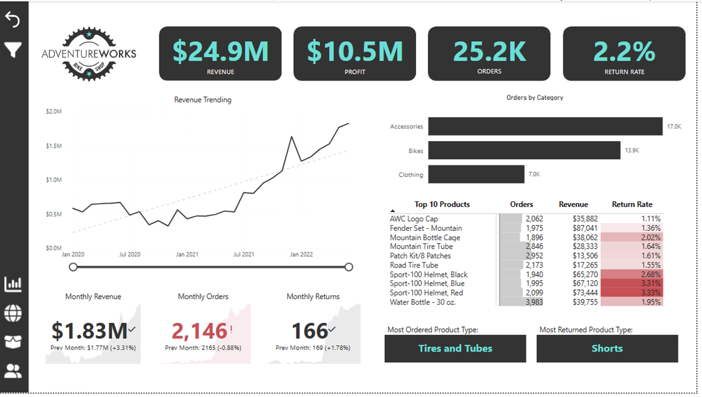
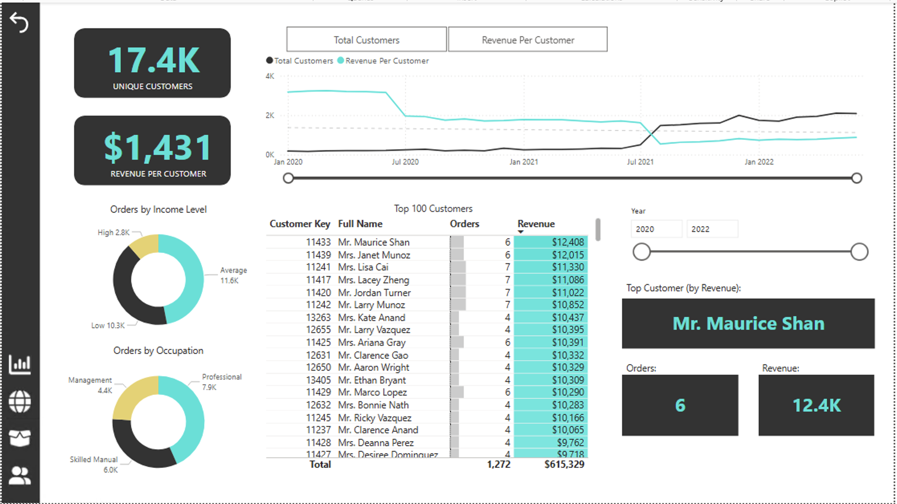
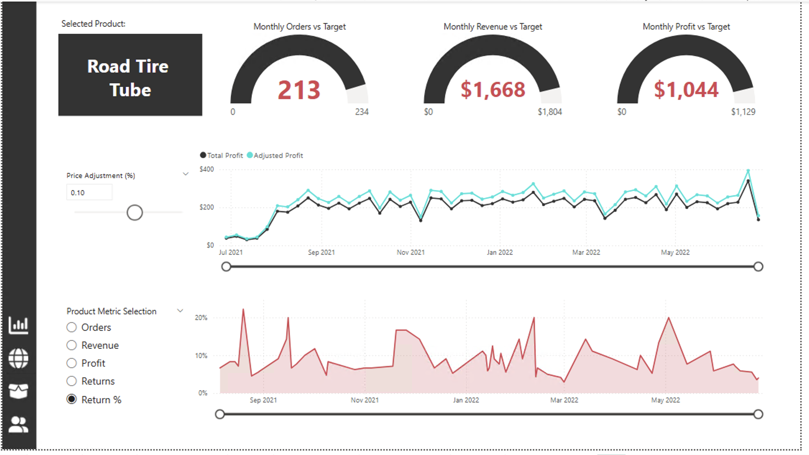

# 📊 Sales & Customer Analytics Dashboard | Power BI 

## 📌 Project Overview

This project showcases the development of an interactive Sales & Customer Analytics Dashboard using Power BI and the AdventureWorks dataset.
The dashboard provides actionable insights into sales performance, customer behavior, product profitability, and return trends through interactive visualizations and drill-through navigation.

---

## 🎯 Business Objectives

- Monitor overall business performance using key KPIs.
- Analyze customer purchasing patterns and revenue contribution.
- Identify top-performing and underperforming products.
- Track revenue, profit, orders, and return rates.
- Enable dynamic analysis through filters and drill-through functionality.
- Support data-driven decision making with interactive dashboards.

---

## 🛠️ Tools & Technologies

| Technology | Purpose |
|------------|----------|
| Power BI Desktop | Dashboard Development |
| Power Query | Data Transformation |
| DAX | KPI & Business Calculations |
| AdventureWorks Dataset | Source Data |
| GitHub | Project Hosting & Documentation |

---

# 📈 Dashboard Pages

---

## 1️⃣ Executive Dashboard

The Executive Dashboard provides a high-level summary of overall business performance.

### Key KPIs

- Revenue
- Profit
- Orders
- Return Rate

### Analysis Included

- Revenue Trend Analysis
- Orders by Product Category
- Top Performing Products
- Monthly Sales Performance
- Product Return Analysis

### Dashboard Preview

---

## 2️⃣ Customer Analytics Dashboard

The Customer Dashboard focuses on customer segmentation and purchasing behavior.

### Key KPIs

- Unique Customers
- Revenue per Customer
- Top Customers by Revenue
- Customer Order Analysis

### Analysis Included

- Revenue Per Customer Trends
- Customer Income Segmentation
- Occupation-Based Analysis
- Top 100 Customers Ranking
- Customer Performance Tracking

### Dashboard Preview

---

## 3️⃣ Product Analytics Dashboard

The Product Dashboard provides detailed product-level performance insights.

### Key KPIs

- Monthly Orders vs Target
- Monthly Revenue vs Target
- Monthly Profit vs Target

### Analysis Included

- Product Performance Monitoring
- Revenue & Profit Tracking
- Product Return Analysis
- Dynamic Product Selection
- Price Impact Simulation

### Dashboard Preview

---

# 👩‍💻 Author

### [Ashia Parveen]

Data Analyst

- LinkedIn: [Ashia](https://www.linkedin.com/in/ashia-parveen-141b39188)

---

## ⭐ Project Highlights

- End-to-End Power BI Development
- Star Schema Data Modeling
- DAX-Based KPI Calculations
- Executive, Customer & Product Analytics
- Interactive Dashboard Design

---
